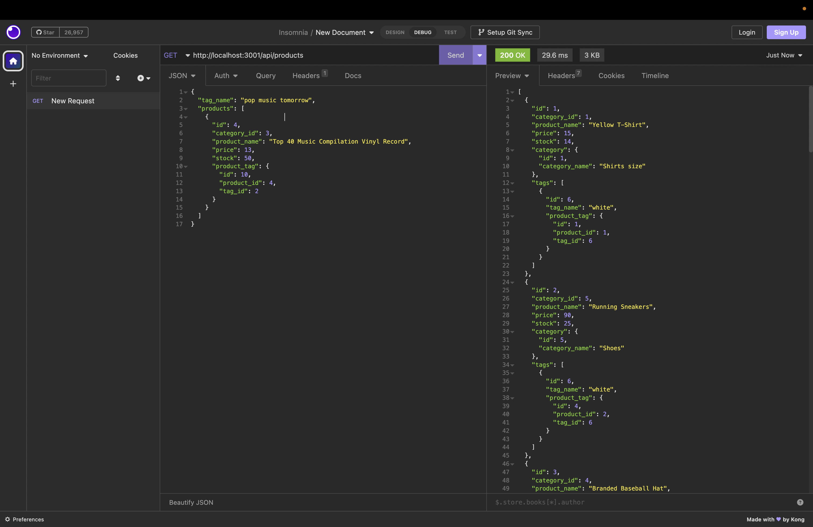

<h1>e-commerce</h1>

## Table of Contents

  * [Description](#description)
  
  * [Installation](#installation)

  * [Usage](#usage)

  * [Links](#links)

  * [Questions](#questions)

## Description

- My motivation was to create a back-end code so thata user could create, update, delete data in Insomnia without using the browser.
- I built this project to learn how to use Insomnia and expand my knowledge with endpoints such as get, post, put, and delete requests.
- It allows user to manage the backend of thier e-commerce company by managing and making any updates to their inventory.
- Learned how to write api endpoints and test them using Insomnia.

## Installation

- Clone code from GitHub repository:
- Open in VS Code and command-line terminal.
- Start mysql and SOURCE scheema.sql.
- Exit mysql an type 'node server.js' to start server. 
- Open Insomnia to manage inventory.

## Usage
  
 - After typing 'node index.js' in command-line terminal, open Insomnia and use url to manage products, categories, and tag data.

    
 

## Links

- GitHub: https://github.com/Caliza/e-commerce
- Google Drive: https://drive.google.com/file/d/11oivq_CbonyM5HwKCKn6X5Mdf1tdKV2f/view?usp=sharing

## Questions

- For any additional questions on usage of application, please contact at rances.rodriguez@gmail.com.